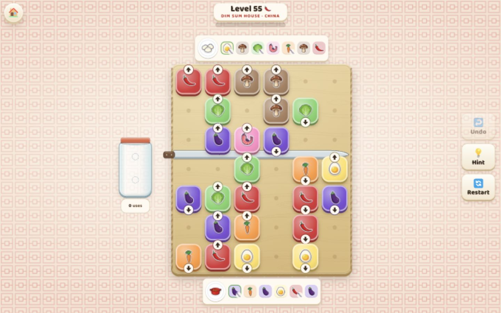
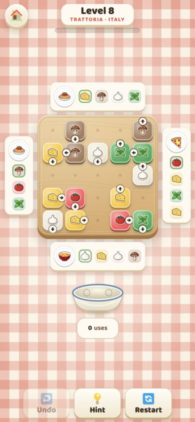

# Pot Luck

Cook each recipe by sliding its ingredients off a wooden board. The arrow on a tile tells you
where it will go. Plan the order before the side bowl fills up.

**[Play Pot Luck in your browser](https://evgeny.io/games/pot-luck/)**

There are 60 levels across six kitchens, from an Italian trattoria to a Chinese dim sum house.
Each kitchen brings different ingredients and its own music. Play on a phone or desktop; your
progress stays in your browser.

<p>
  
  
</p>

## How to play

- Tap an ingredient to slide it in the direction of its arrow. A tile blocking its path must leave first.
- Follow the green rings on each recipe. They mark the ingredients that dish can take now.
- Early ingredients wait in the side bowl until a recipe needs them. Space is limited. The glass jar releases the last ingredient added first.
- Press and hold a tile to preview its path. Undo is unlimited, and Hint shows a move toward a solution.

Use the bowl sparingly to earn more stars. Later kitchens hide ingredients under cloches and tie
pairs of tiles together. Turn pads redirect food. Sliding across a knife chops an ingredient for
recipes that need it.

The counter beneath the bowl or jar shows how many ingredients you have parked. Tap it to see
the star goals for that level. Undo restores the count.

## Run locally

```bash
npm ci
npm run dev
```

Open [localhost:5190](http://localhost:5190/).

```bash
npm test       # Rules, campaign solutions and animation sequencing
npm run build  # TypeScript checks and the production build
```

## Development

The game uses TypeScript and Vite. Its rules and solver live in `src/core/`; `BoardView` animates
the simulation's events. Artwork is generated locally with Z-Image Turbo through mflux.
The free Sticker set has matching art for all 32 ingredients and 27 dishes.

Useful URL flags:

| Flag | What it does |
| --- | --- |
| `?level=N` | Open a specific level |
| `?debug=1` | Show difficulty stats and the auto-solve control |
| `?debug=0` | Hide developer controls |
| `?progress=N` | Unlock levels up to N |
| `?icons=sticker` | Preview an art set; also accepts `kawaii`, `watercolor` or `retro` |
| `?reset` | Clear saved progress |

Level generation and experiments use [Bun](https://bun.sh):

```bash
bun scripts/build-levels.ts 1-60  # Generate levels into .cache/levels
bun scripts/build-levels.ts merge
bun scripts/build-levels.ts report
bun scripts/experiment.ts
```

Read [the design notes](docs/DESIGN.md) for the campaign and mechanics.
[The art handoff](docs/ART-HANDOFF.md) covers prompts and the local generation pipeline.
[Experiments](docs/EXPERIMENTS.md) document how the rules affect puzzle depth.
[Deployment](docs/DEPLOYMENT.md) explains the publishing workflow.

Asset credits and licence notices are in [THIRD_PARTY_NOTICES.md](THIRD_PARTY_NOTICES.md).
Sound is synthesized with the Web Audio API. [The soundtrack notes](docs/AUDIO.md) describe the
arrangements and explain how to render a listening preview.
