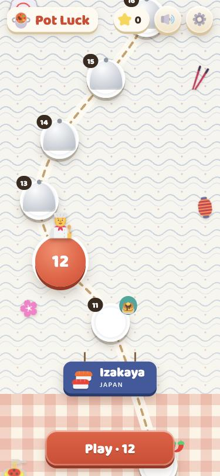
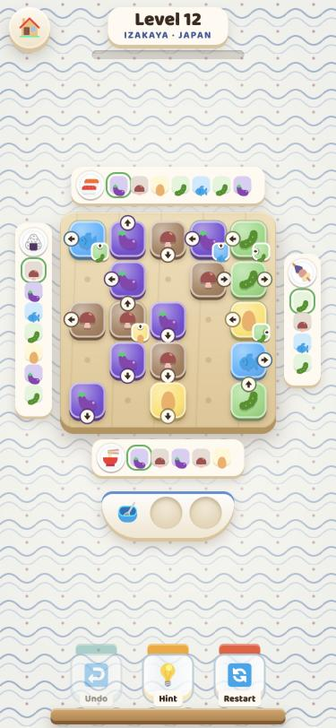
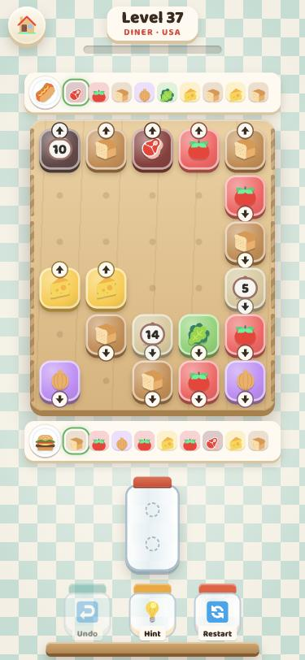
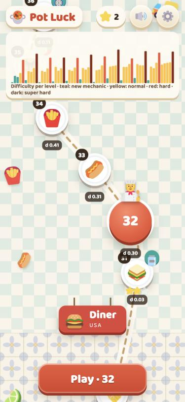
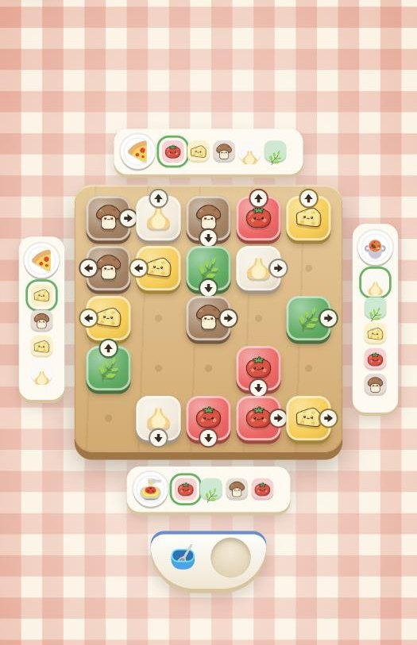

# Pot Luck: design

This is a calm kitchen puzzle. You tap ingredient tiles, each one slides off the board the way its
arrow points, and it lands in the pot on that side. Pots want their ingredients in recipe order.
There is no timer, no move limit, and undo is unlimited.

This is the second version of this document, written after the owner's first playtest. The first
version's reasoning and data are still in [PLAN.md](PLAN.md) and [EXPERIMENTS.md](EXPERIMENTS.md).

<p>
  
  
  
  
</p>

## What changed after the first playtest

| Feedback | Change |
|---|---|
| "Once the bowl appears the game feels too easy." | The bowl starts with **one spot** (levels 3–7) and grows to two at level 8. Hard levels often take a spot away again, and super hard levels have one spot (or a 2-spot jar). The curve's base is higher. The data agrees: a 3-spot bowl gives about one critical decision per level, a 1-spot bowl about four to six. |
| "Different cuisines, so every level feels different." | Chapters of ten levels are cuisines: **Italy** (Trattoria), **Japan** (Izakaya), **Mexico** (Cantina), **USA** (Diner), **India** (Spice Market), **China** (Dim Sum House). Each has its own ingredients, dishes, background pattern, cutting-board wood, map region and music. |
| "A hidden ingredient until you reveal its neighbours; one you can't use until N ingredients are added; linked ingredients like in Pixel Picnic." | Three new mechanics: **cloches** (hidden until a neighbouring tile leaves), **kitchen timers** (unlock after N deliveries), **tied pairs** (leave together, the tapped one first). They are measured in EXPERIMENTS.md (round 2): all add depth, and tied pairs add the most. |
| "The kebab at the bottom of level 50 is confusing." | The skewer is now a **glass jar**: ingredients stack up inside, and only the one on top comes out. Same rule (last in, first out), but the picture explains it. |
| "Dishes look squished, aligned differently." | Every pot is an **order ticket with a round plate**. All dish icons sit at the same size in the same plate, on every edge. |
| "Ugly jumping animations when an ingredient is added." | Food flies to the required ingredient chip, which gets its tick after landing. A finished plate settles at the center of its ticket's row or column and receives a small green check. Blocked tiles nudge toward where they wanted to go. |
| "Sounds are from Pixel Picnic." | Synthesized kitchen sounds accompany written melodies for each cuisine. The arrangements have responses, quieter bridges and a return, with pauses at the end of phrases. |
| "The style looks like Pixel Picnic." | A new identity, shown in full below. Icon styles are compared in `_review/style/index.html`. |
| "The map should open step by step, but in its own way." | A **world food tour**: one region per cuisine, with its pattern and a hanging sign. Levels are plates along a dashed route. Finished plates show their dish and stars. Upcoming ones wait under a cloche. Hard levels carry one chili, super hard two. A little chef marks where you are. |

## Rules (as built)

- **Tiles.** Each tile has an ingredient and an arrow. Tap a tile:
  - if its lane to the edge is clear, it slides into the pot on that stretch of edge;
  - otherwise it nudges and stays, with no penalty.
  - Press and hold to see the lane: green means the pot takes it, amber means it goes to the bowl,
    red means it is blocked.
- **Pots.** A pot takes the tile if it is the *next* item of its recipe; the ticket highlights it.
- **The bowl.** A tile the pot doesn't want yet waits in the bowl. A bowl item flies to a pot the
  moment some pot wants it. With a full bowl, a wrong slide isn't allowed.
- **Win and jam.** The level is won when every dish is served. When no tile can move, it's a
  "Kitchen jam": Undo or Restart, and Hint tells you how many moves to undo.
- **Stars** count bowl uses against par (the fewest any solution needs): ★★★ at or below par,
  ★★ within par + 2.

The mechanics, in the order the campaign introduces them:

| Level | Mechanic | Rule | On screen |
|---|---|---|---|
| 3 | bowl | Early ingredients wait (1 spot, 2 from level 8) | A ceramic bowl with spots |
| 6 | salad | Any order | Every remaining chip is ringed |
| 11 | stacks | Another tile underneath; the cell stays taken | Corner badge with the hidden tile and its arrow |
| 16 | tied pairs | Leave together, the tapped one first, only if both can go | Twine between the two tiles; pressing shows both lanes |
| 21 | lids | A pot opens after another pot is served | A domed plate and an "after 🍝" badge; the recipe stays visible |
| 26 | cloche | Hidden and stuck until a neighbouring tile leaves | A silver dome that lifts off with steam |
| 31 | jar | Last in, first out | A glass jar; the top item glows |
| 36 | timer | Unlocks after N more deliveries | A kitchen-timer badge counting down |
| 41 | two dishes | A pot cooks two recipes in a row | The current recipe is shown; the next recipe appears when it is ready to cook |
| 46 | turn pads | A sliding tile turns to the pad's arrow | A yellow pad; the lane preview shows the bend |
| 51 | knife | Crossing it chops the ingredient | A tapered steel blade with a riveted wooden handle; chopped chips carry a knife |

## The campaign: a world food tour

There are 60 levels, 10 per cuisine. Within each chapter:

- the 5th level is **hard** (🌶);
- the 10th is **super hard** (🌶🌶);
- the 1st and 6th usually bring a new mechanic on a small board, which doubles as the breather
  after a peak.

Normal levels practise the newest mechanic and mix in one or two older ones. Every level is
generated, solver-verified, measured and stored with its solution; the tests replay all 60.

| Chapter | Ingredients | Dishes | New |
|---|---|---|---|
| 1–10 Italy · Trattoria | tomato, basil, garlic, cheese, mushroom, olive, onion, eggplant | pasta, pizza, soup, salad | basics, bowl, salad, 2-spot bowl |
| 11–20 Japan · Izakaya | rice, fish, shrimp, egg, cucumber, mushroom, carrot, eggplant | sushi, ramen, bento, onigiri, oden | stacks, tied pairs |
| 21–30 Mexico · Cantina | corn, avocado, chili, beans, onion, garlic, lime, chicken | taco, burrito, tamale, soup | lids, cloche |
| 31–40 USA · Diner | bread, cheese, meat, lettuce, tomato, onion, blueberries | burger, fries, hot dog, pancakes, sandwich | jar, timer |
| 41–50 India · Spice Market | rice, chili, onion, ginger, peas, carrot, coconut | curry, flatbread, stew, wrap | two dishes, turn pads |
| 51–60 China · Dim Sum House | shrimp, egg, mushroom, lettuce, carrot, fish, chili, eggplant | dumplings, noodles, hot pot, mooncake, fortune cookie | knife bar |

Each cuisine's ingredient colours are checked so that every pair is easy to tell apart (OKLab
readability ≥ 0.9, enforced in `tests/palette.test.ts`).

Difficulty `d` per level (52 of 60 within tolerance of the target curve):

```
  1 intro                                              0.00
  2 intro     ████████                                 0.20
  3 intro     ██████                                   0.14  bowl
  4 normal    █████████                                0.23
  5 hard      █████████████████████                    0.53
  6 intro     ███                                      0.07  salad
  7 normal    ███████████                              0.28
  8 normal    ██████████                               0.26  2-spot bowl
  9 normal    ██████████████                           0.35
 10 superhard █████████████████████████████            0.73
 11 intro     █                                        0.01  stacks
 12 normal    ███████████                              0.28
 13 normal    ██████████                               0.26
 14 normal    █████████████                            0.34
 15 hard      ███████████████████████                  0.58
 16 intro     ██                                       0.04  tied pairs
 17 normal    ███████████████                          0.37
 18 normal    ███████████                              0.29
 19 normal    ██████████████                           0.34
 20 superhard ███████████████████████                  0.59
 21 intro     ██                                       0.05  lids
 22 normal    ████████████                             0.30
 23 normal    ███████████                              0.28
 24 normal    ██████████████                           0.36
 25 hard      ███████████████████████                  0.58
 26 intro     ████                                     0.09  cloche
 27 normal    ██████████████                           0.35
 28 normal    ████████████                             0.31
 29 normal    ███████████████                          0.36
 30 superhard ██████████████████████████               0.65
 31 intro     █                                        0.03  jar
 32 normal    ████████████                             0.30
 33 normal    ████████████                             0.31
 34 normal    ████████████████                         0.41
 35 hard      ████████████████████████                 0.61
 36 intro     ████                                     0.11  timer
 37 normal    ███████████████                          0.38
 38 normal    ████████████████                         0.39
 39 normal    ████████████████                         0.40
 40 superhard ███████████████████████████████          0.77
 41 intro     ███                                      0.07  two dishes
 42 normal    ███████████████                          0.37
 43 normal    ███████████████                          0.37
 44 normal    ██████████████████                       0.44
 45 hard      ███████████████████████                  0.57
 46 intro     █████                                    0.12  turn pads
 47 normal    █████████████████                        0.44
 48 normal    ████████████████                         0.41
 49 normal    ████████████████                         0.41
 50 superhard █████████████████████████████            0.73
 51 intro     ███                                      0.07  knife bar
 52 normal    ███████████████                          0.38
 53 normal    ██████████████                           0.34
 54 normal    ███████████████████                      0.47
 55 hard      ████████████████████████████             0.70
 56 normal    █████████████████                        0.43
 57 normal    ██████████████████                       0.45
 58 normal    ███████████████████                      0.47
 59 normal    ███████████████████                      0.48
 60 superhard █████████████████████████████            0.72
```

Compared with the first version, normal levels moved from 0.2–0.38 to 0.23–0.48. Greedy players
now win 43–94% of normal levels, against 80–100% before.

### How difficulty is measured

Each level is played 100–240 times by four simulated players:

- random taps;
- a casual player who delivers when it can;
- a greedy player who makes the best-looking move;
- a thinker who looks five natural moves ahead.

The solver walks the solution and counts critical decisions, the steps where another move loses.

`d = 0.10·(1−random) + 0.15·(1−casual) + 0.30·(1−greedy) + 0.30·(1−thinker) + 0.15·min(1, 2·critical/decisions)`

The generator bisects a hardness knob until `d` lands on the curve, then a solver-checked local
search finishes. Tier guard bands keep intros gentle and peaks deep but fair. Levels where a weaker
player beats a stronger one are rejected, because they only exploit one heuristic.

## Look and sound

The goal was a look of its own, so that Pot Luck and Pixel Picnic feel like siblings, not twins.

- **Palette:** warm kitchen colours (espresso ink, tomato red, basil green, saffron, teal) instead
  of Pixel Picnic's purple and yellow.
- **Type:** Baloo 2 (OFL), not Nunito.
- **Tiles:** enamel, each in its ingredient's colour with a white glaze rim and a cream arrow
  badge.
- **Pots:** order tickets with a plate. Food lands on the required recipe ingredient, then its tick appears. Mobile recipe icons are larger. Each ticket shows one recipe; the next appears when the current dish is complete.
- **Board:** warm wood for each cuisine, with curved grain, faint knots and a routed groove around the rim.
- **Storage:** a ceramic bowl with an oval opening and centered spaces, or a glass jar with a red cap. The jar has a wider neck, soft glass highlights and a badge on the next ingredient, preserving the last-in, first-out rule. A counter shows total uses and the three-star allowance; tap it for all star ranges.
- **Actions:** enamel buttons with readable Undo, Hint and Restart labels, beneath the board on phones and beside it on wide screens.
- **Finished dishes:** a small green check at the plate's edge leaves the dish picture visible. Each plate centers along the edge when its ingredient strip disappears.
- **Dialogs:** recipe cards with a ruled paper texture, a red margin line and a tape-like title.
- **Backgrounds** change per cuisine: red gingham, indigo waves, talavera tiles, diner checks,
  block-print rosettes and a lattice. The board's wood changes with them.
- **Map:** the world food tour described above. Restaurant signs sit without hanging rope stubs; ingredient props use the equipped art set. Rounded silver serving covers have a rim and handle, shared with covered ingredients.
- **Sound:** synthesized kitchen sounds with an arrangement for each cuisine. Italy uses mandolin
  and accordion; Japan alternates koto and flute. The longer phrases and quieter bridges are
  described in [AUDIO.md](AUDIO.md).

**Icon styles.** Sticker is the free default and covers all 32 ingredients and 27 dishes. Kawaii, Watercolor and
Retro Diner are paid sets with five samples each; missing pictures fall back to Sticker. `_review/style/index.html` retains
the original style comparison. Use `?icons=sticker`, `kawaii`, `watercolor` or `retro` to preview an
equipped set. Local generation commands and remaining work are in [ART-HANDOFF.md](ART-HANDOFF.md).



## Open questions

1. **Paid art sets.** Each paid set needs 54 more pictures to match Sticker's coverage.
2. **Is the curve right?** Normal levels are now noticeably harder. The first chapter should be
   playtested for frustration, especially levels 4–7 with a single bowl spot.
3. **Router or hold bowl** (from v1): arrows can still "lie" (a tile pointing at a pot that doesn't
   need it). Worth a playtest.
4. **Stars:** par-based stars are demanding on gridlock levels.
5. **Music:** playtest the longer arrangements. There is a toggle in Settings.

## Not done yet

- three.js rendering;
- night mode;
- Russian strings;
- endless mode;
- a hint worker (the hint solves on the main thread, 50–300 ms);
- long tiles and sticky dough;
