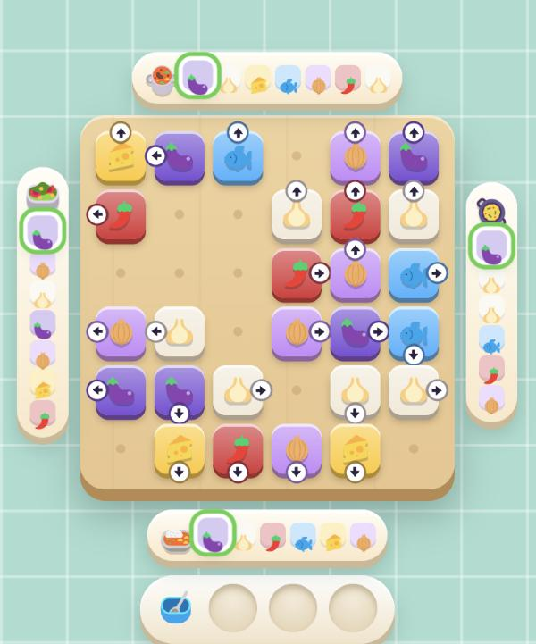
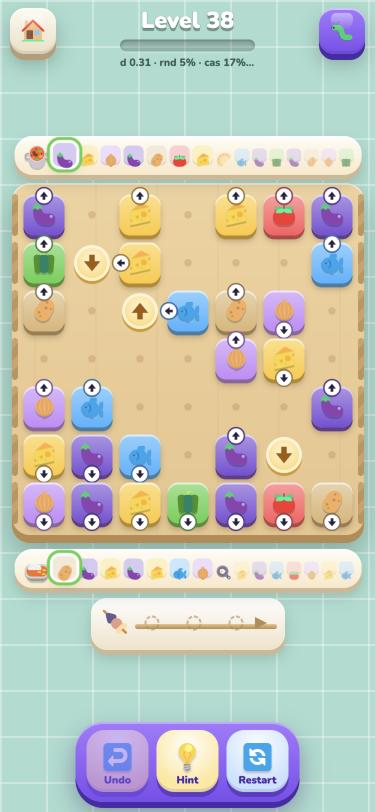
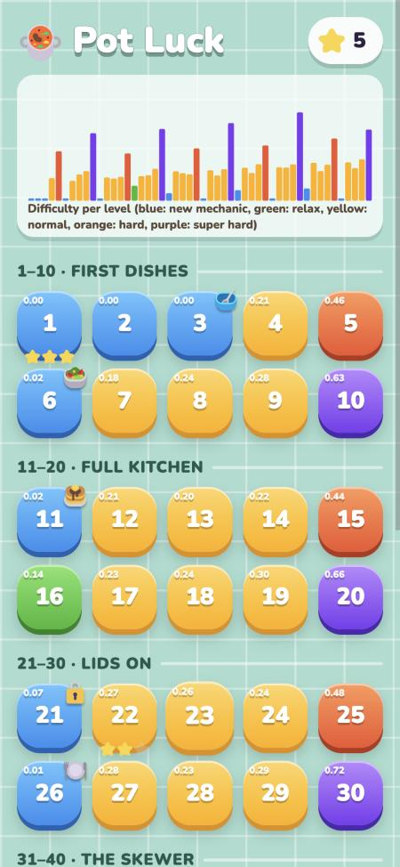

# Pot Luck: design

This is a calm kitchen puzzle. You tap ingredient tiles, each one slides off the board the way its
arrow points, and it lands in the pot on that side. Pots want their ingredients in recipe order.
There is no timer, no move limit, and undo is unlimited.

This document is the current state of the rules, the recommended rule set (backed by
[EXPERIMENTS.md](EXPERIMENTS.md)), how difficulty is measured, the campaign's shape, and what is
still open.

<p>
  
  
  
</p>

## Rules (as built)

- **Tiles.** Each tile has an ingredient and an arrow.
  - Tap a tile: if every cell of its lane up to the edge is empty, it slides off into the pot on
    that stretch of edge.
  - Otherwise it shakes, and the blocking tile flashes. There is no penalty.
  - Press and hold to see the lane:
    - green dots mean the pot will take it;
    - amber dots mean it will go to the bowl;
    - red dots mean it is blocked.
- **Pots.** A pot takes the tile if it is the *next* item of its recipe; the strip highlights it.
- **The bowl.** A tile the pot doesn't want yet drops into the **bowl** (3 spots).
  - A bowl item flies to a pot automatically the moment some pot wants it. When two pots want it at
    the same moment, the first one clockwise from the top gets it.
  - With a full bowl, a wrong slide isn't allowed: the tile shakes and the bowl flashes.
- **Walls.** Edges without a pot are walls (hatched), and no tile ever points into a wall.
- **Win.** Every pot served, so the board and the bowl are empty (levels are zero-waste).
- **Stuck.** No legal move. A "Kitchen jam!" dialog offers Undo or Restart. The Hint button names
  how many undos get you back to a winnable position.
- **Stars** reward thinking, not speed:
  - ★★★: bowl uses at or below *par*, the fewest any solution needs (computed by the solver);
  - ★★: within par + 2;
  - ★: otherwise.

When a rule was ambiguous, I picked the version that is easiest to read on screen:

- **Lids.** A tile sent to a closed pot isn't blocked; it goes to the bowl like any unwanted tile.
  The lid is a badge ("🔒 after 🍛") and the recipe stays visible under it, so nothing is hidden.
- **Stacks.** A stack shows the tile underneath as a corner badge with its own arrow. The cell
  stays occupied until both tiles have left.
- **Knife bar.** The bar is a line between two rows. A tile that crosses it arrives chopped, and
  such tiles carry a little knife badge *before* they move, so the result is never a surprise.
- **Pads.** A tile that slides onto a turn pad continues in the pad's direction. The lane preview
  shows the bend.

## Recommended rule set

The baseline is:

- **dense boards:** about 70% of the cells hold tiles;
- **strict recipes;**
- **router bowl with auto-delivery:** a bowl item can go to *any* pot that wants it.

Three twists sit on top of it:

| Twist | What it adds | Why it's in |
|---|---|---|
| **Stacks** | A cell stays blocked for two departures, and the tile underneath has its own arrow. | Cheap to learn, phone-friendly (more ingredients on a small board), and strong combined with a 2-spot bowl. |
| **Lids** | The order in which pots finish matters. | Greedy players drop to 37%. "Free the pot that opens the lid" is a real aha. |
| **Skewer** | Only the last item in can come out. | The deepest single rule: about 6–8 critical decisions per level against 1 for the baseline, and one sentence to explain. |

Some twists stay for variety, not depth:

- an any-order **salad** pot on relax levels;
- pots that cook **two dishes**;
- **turn pads** and the **knife bar**, which make lanes harder to read but don't add planning;
- **frozen tiles**.

These were rejected, with evidence in EXPERIMENTS.md:

- **wild spice:** a hidden trap in zero-waste levels;
- **hold bowl as the default:** too forgiving;
- **split edges:** they make levels easier and harder to read;
- **any-order everywhere:** trivial.

The deepest trap needs no extra rule at all: **which copy first**. When two onions both go into the
soup, use the one that is *blocking* something. Delivering the next ingredient is not always safe,
and that is what keeps even the baseline interesting.

## How difficulty is measured

Every level is generated so that a solution exists by construction, then verified by the solver.
Four simulated players play it 100–240 times:

| Player | Plays like |
|---|---|
| random | taps any legal tile |
| casual | delivers when it can, otherwise parks at random |
| greedy | the best-looking move: deliver, otherwise park what is needed soon and frees something |
| thinker | for each of its 4 most natural moves, imagines the next 5 moves of natural play and avoids moves that jam the kitchen within that horizon |

The solver also walks the reference solution and counts **critical decisions**, the steps where
another legal move loses.

One score combines all of this:

`d = 0.10·(1−random) + 0.15·(1−casual) + 0.30·(1−greedy) + 0.30·(1−thinker) + 0.15·min(1, 2·critical/decisions)`

Using every player matters. A tuner that only targeted greedy learned to exploit greedy's blind
spot: it produced levels where random tapping beat greedy. A level is also penalized when a weaker
player wins more often than a stronger one.

**Generation follows Pixel Picnic's loop:**

1. A virtual cook builds the reference line, with deliberate parking detours.
2. Tiles are placed in reverse removal order, preferring cells in the lanes of soon-to-leave tiles.
3. A hardness knob (detours, tightness, horizon) is bisected until `d` lands on the curve.
4. The three closest candidates are re-measured with more games.
5. A solver-checked local search finishes the job. It moves tiles, swaps ingredients, re-aims
   tiles, and swaps recipe items.
6. Tier guard bands keep levels honest:
   - intro and relax levels stay gentle;
   - hard levels must still be fair (the thinker wins at least 30%);
   - every normal, hard and super hard level has a minimum number of critical decisions.

## The campaign: a sawtooth, not a ramp

The first 50 levels are built, and all of them replay their stored solution in the tests. `d` per
level:

```
  1 intro                                              0.00
  2 intro                                              0.00
  3 intro                                              0.00  bowl
  4 normal    ████████                                 0.21
  5 hard      ██████████████████                       0.46
  6 intro     █                                        0.02  salad
  7 normal    ███████                                  0.18
  8 normal    ██████████                               0.24
  9 normal    ███████████                              0.28
 10 superhard █████████████████████████                0.63
 11 intro     █                                        0.02  stacks
 12 normal    █████████                                0.21
 13 normal    ████████                                 0.20
 14 normal    █████████                                0.22
 15 hard      ██████████████████                       0.44
 16 relax     ██████                                   0.14
 17 normal    █████████                                0.23
 18 normal    █████████                                0.24
 19 normal    ████████████                             0.30
 20 superhard ███████████████████████████              0.66
 21 intro     ███                                      0.07  lids
 22 normal    ███████████                              0.27
 23 normal    ██████████                               0.26
 24 normal    ██████████                               0.24
 25 hard      ███████████████████                      0.48
 26 intro                                              0.01  two dishes
 27 normal    ███████████                              0.28
 28 normal    █████████                                0.23
 29 normal    ████████████                             0.29
 30 superhard █████████████████████████████            0.72
 31 intro     ████                                     0.10  skewer
 32 normal    ████████████                             0.30
 33 normal    ██████████                               0.26
 34 normal    ██████████████                           0.34
 35 hard      ████████████████████                     0.51
 36 intro                                              0.00  turn pads
 37 normal    ████████████                             0.31
 38 normal    ████████████                             0.31
 39 normal    █████████████                            0.34
 40 superhard █████████████████████████████████        0.82
 41 intro     █████                                    0.11  knife bar
 42 normal    ██████████████                           0.35
 43 normal    ███████████                              0.28
 44 normal    █████████████                            0.33
 45 hard      ███████████████████████                  0.58
 46 intro                                              0.00  frozen tiles
 47 normal    ██████████████                           0.35
 48 normal    ████████████                             0.30
 49 normal    ███████████████                          0.38
 50 superhard ██████████████████████████               0.66
```

**How a block of ten is shaped:**

- The first level is an intro or a breather: a new mechanic on a small 5×5 board, where the
  mechanic is the whole point.
- Next come three normal levels with small ups and downs.
- The 5th level is **hard**.
- The 6th is a breather.
- Then three more normal levels, each a notch higher.
- The 10th is **super hard**.

The base slowly rises from 0.20 to 0.38 by level 60. Levels after an intro practise the new
mechanic; later ones mix two (three on super hard levels).

**Variety comes from shape as well as difficulty.** Levels alternate:

- 5×5 to 7×7 boards;
- four, three or two pots;
- *rush* boards (big, loose, a 4-spot bowl) and *gridlocks* (dense, a 2-spot bowl or a skewer).

| Tier | Typical numbers |
|---|---|
| Normal | Greedy wins 80–100%, the thinker 100%, 1–6 critical decisions. Thinking a little is enough. |
| Hard | Greedy 12–57%, the thinker 65–100%, 3–6 critical decisions. You have to look ahead. |
| Super hard | Greedy 28–41%, the thinker 25–60%, 6–27 critical decisions. Deep traps. |

## Ladder to level 100 (proposal)

| Levels | New | Notes |
|---|---|---|
| 1–3 | one pot, two pots, the bowl | Tiny boards. The bowl level can't be won without parking. |
| 6 | salad (any order) | A relief pot, used on relax levels from then on. |
| 11 | stacks | Then practised at 12–19. |
| 21 | lids | |
| 26 | two dishes | Also used to keep recipes short on two-pot boards. |
| 31 | skewer | The skewer becomes the usual "boss bowl" on hard levels. |
| 36 | turn pads | Reading challenge. |
| 41 | knife bar | Two pots, up/down lanes. Reading challenge. |
| 46 | frozen tiles | |
| 51–60 | (no new rule) | 2-spot bowls on normal levels, more 7×7 boards, lids + skewer combos. |
| 61 | hot bar (cooked) | A reskin of the knife: "cooked carrot". Recipes can ask for chopped *and* cooked. |
| 71 | long tiles (leek, baguette) | Not implemented yet. They block two cells and their lane starts at the head. |
| 81 | sticky dough | Not implemented yet. It slides *until* blocked, so the board changes: the most complex rule, kept for late. |
| 91–100 | chef's table | Combinations only, on the biggest boards. |

## Open questions for the owner

1. **Router or hold bowl.**
   - The router bowl (any bowl item can go to any pot) is deeper, but arrows can "lie": an onion
     pointing at the soup may really be for the stew, at the cost of a bowl spot.
   - A hold bowl keeps arrows truthful and is much easier.
   - Worth a playtest of each.
2. **Auto or tap delivery from the bowl.** Auto (current) needs a tie rule (clockwise). Tapping
   gives control but adds taps. The difficulty is the same.
3. **Star rule.** Bowl uses against par rewards perfect play. The alternative is stars for no
   hint/undo. With par, three stars can be quite hard on gridlock levels (par 5–10).
4. **Board size on phones.** 7×7 boards give about 42 px cells at 375 px width. Fine on a desk;
   worth checking on a real phone with real thumbs.
5. **Turn pads and the knife bar.** They add reading difficulty, which the metrics can't see. Keep
   them for variety, or drop them?
6. **Art direction.** See `_review/art/index.html`: Fluent emoji (current), pixelated emoji, local
   Z-Image Turbo, and pixelated Z-Image. Generated art reads well thanks to its black outlines.
   White ingredients (egg, garlic) need a coloured backdrop in the prompt.
7. **Calibration.** `d` and its weights are educated guesses. A playtest that logs time per level
   and undo counts would let us fit them to real players.

## Not done yet

- three.js rendering;
- night mode;
- Russian strings;
- shop and coins;
- endless mode;
- a worker for the hint (it currently solves on the main thread, about 50–300 ms);
- long tiles and sticky dough;
- a hot bar on its own.
